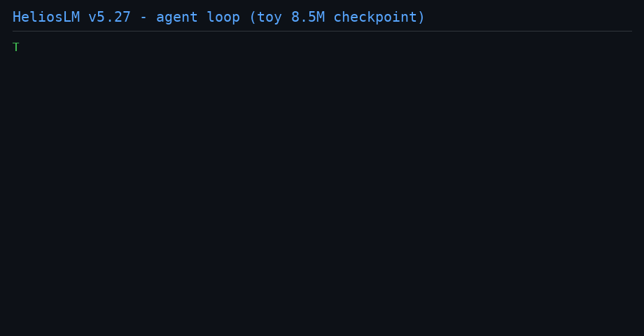
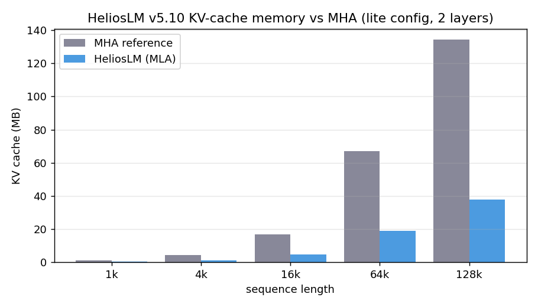

# HeliosLM — A Hackable DeepSeek-V3/K3-Style LLM Stack in Pure PyTorch

A from-scratch PyTorch reference implementation of a modern LLM stack: MLA attention with weight absorption, sigmoid-gated MoE with auxiliary-loss-free load balancing, hybrid linear attention, speculative decoding, FP8 training, a DualPipe schedule simulation, a vLLM-style serving engine, a **verifiable agent layer** (strict tool schema, bitwise-replay oracle), DSA sparse attention, Mooncake-style prefill/decode disaggregation, and tool-tuned checkpoints. Built to be **read, modified, and verified** — every core path is unit-tested and many are checked with bitwise-equivalence tests. Everything runs on CPU.

> **One-liner:** If you want to understand (or hack on) how DeepSeek-V3/K3-class models actually work — without needing a GPU cluster first — this repo is for you.

[](https://github.com/tonythetiger168/helioslm/actions)


-ee4c2c)



## Who is this for?

| You are... | What HeliosLM gives you |
|---|---|
| **A learner** who wants to understand MLA, MoE routing, DualPipe, speculative decoding | Annotated, review-hardened PyTorch with 48 unit tests that act as executable documentation |
| **A researcher** who wants a stack to modify, ablate, and extend quickly | Single-process, CPU-iterable training + serving code — change one file, run one test |
| **A practitioner** evaluating serving/quantization techniques | vLLM-style paged engine, GPTQ/AWQ/FP8/MXFP4 quantization, MTP speculative decoding — all inspectable |

**Honest positioning:** this is a correctness-focused reference implementation, not a throughput-optimized production engine (see [Known Limitations](#known-limitations)).

## Quick Start

```bash
pip install torch
python -m helioslm_v5.tests.test_v5     # 48 unit tests
python integration_test_v51.py          # 9 end-to-end integration tests
python -m helioslm_v5.tests.test_agent  # 9 agent-layer oracles (v5.23)
python -m helioslm_v5.tests.test_v5_stage_a   # T15 real-model oracles (v5.26)
python -m helioslm_v5.tests.test_v5_stage_b   # T17 tool-tuned end-to-end (v5.27)
python -m helioslm_v5.tests.test_disagg_pareto  # T18 Pareto sweep oracles (v5.28)
```

```python
from helioslm_v5.configs.config_v5 import HeliosLMv5Config
from helioslm_v5.src.model_v5 import HeliosLMv5

model = HeliosLMv5(HeliosLMv5Config(size="lite"))   # CPU-friendly
out = model.generate([[1, 2, 3]], max_new_tokens=20, temperature=0)
print(out)
```

<!-- TODO: paste actual generate() output here, e.g.:
```
generated: [[1, 2, 3, ...]]
```
Nothing sells an LLM repo like showing it produce tokens. -->

## Capabilities at a glance

| Area | Implementation |
| --- | --- |
| **Attention** | MLA with **weight absorption** — latent-only KV cache, **−97.7% memory vs MHA** (full config), verified equivalent to the expanded path (<1e-4). Hybrid linear attention: Gated Delta Rule layers interleaved with MLA, fixed-size recurrent state cache, decode ≡ one-shot (<2e-7). RoPE scaling: linear / NTK / YaRN. DSA-style sparse top-k decode over the latent cache (k≥L exactly dense). Sliding-window attention with StreamingLLM sinks (O(W) decode), per-head QK-norm, Gemma-style logit soft-capping. |
| **MoE** | Sigmoid-gated fine-grained experts with **auxiliary-loss-free** load balancing (selection-only bias, heuristic or quantile updates). **LatentMoE**: routed experts in a shared latent space. **SiTU-GLU** tanh soft-capped activation. |
| **Cross-layer** | **Attention Residuals** — per-layer gated injection of accumulated lower-layer attention outputs, threaded through DualPipe (gradient-exact, bitwise-verified). |
| **Agent** | v5.23 agent layer: strict tool-call schema/parser (16 error classes), deterministic sandboxed tools, trajectory bitwise-replay oracle, ground-truth-by-construction toy envs, routing gates (v5.22 decision-audit discipline); v5.26 real-model oracles (T15); v5.27 **tool-tuned checkpoint** trained on agent-loop replays (data format == inference by construction) — T17 end-to-end baseline parse 0.15 / finish 1/9, `sparse_top_k=4` ~= dense; hardened by real-model findings (TOOL_ERROR recovery, ASCII-safe docs) |
| **Disaggregation** | v5.25 Mooncake-style prefill/decode module behind a monotonicity gate; v5.28 three-axis **Pareto sweep** (makespan / workers / worker-seconds) with latency-cost curves per workload — cache-aware anti-monotonicity recorded as a structural finding, not hidden |
| **Speculative decoding** | DeepSeek-style MTP with **strict verification** (residual (p−q)₊ resampling), batch support, O(1) cache-truncation rollback; hybrid recurrent-state rollback via restore+replay. |
| **Serving** | vLLM-style engine: paged KV accounting, copy-on-write forks, watermark-aligned continuous batching. |
| **Training** | FP8 trainer (native float8 + STE, E5M2 gradient hooks, AdamW master weights), DualPipe schedule simulation (recompute-based, gradient-exact), GRPO (real sampling, k3 KL, answer-extraction rewards), Muon optimizer (Newton–Schulz orthogonalized momentum, optional per-head blocks), QAT straight-through fake-quant training. |
| **Adaptation** | `AdaptationLoop`: transferred harnesses must be re-accepted under the target workload's gate or dropped; cold/prefix-free targets shed draft+pool, matching the v5.16 break-even data |
| **Harness evolution** | `inference/harness_evolver.py`: ModularRSI-style module-wise search over draft/pool/tier configs; the temp-0 bitwise gate makes 'latency evolves, answers never change' an enforced invariant (1.41x modeled speedup, 0 gate rejects) |
| **Prefix pool** | `inference/prefix_pool.py`: blake2b(token-block + config fingerprint) keyed KV snapshots, LRU, exact-length past; pooled greedy == from-scratch bitwise |
| **Stream scoring** | `eval/score_stream.py`: score any engine's (prompt, output) JSONL under a reference model; A/B compare with bootstrap CI — the audit-side complement to serving engines |
| **Spec telemetry** | `bench_spec_breakeven.py`: draft x cache-state sweep in the colibri-P3 schema; acceptance + expert hit-rate per decode context, `best_draft_per_cache_state()` picker |
| **Expert streaming** | `expert_store.py`: routed experts tiered to a memory-mapped file, LRU residency with hit/miss/eviction telemetry; streaming forward is bitwise-identical to dense (oracle-verified, roadmap #6) |
| **Toy checkpoints** | `checkpoints/toy_v5.13.pt` — 8.5M char-level model trained on the repo's own source in ~10 CPU-minutes (`examples/train_toy_checkpoint.py`); `checkpoints/tool_tuned_v5.27.pt` — tool-tuned on agent-loop replays (`examples/train_tool_tuned.py`, periodic save + resume); `generate()` / harness / MTP / agent loop run against trained weights |
| **Quantization** | **True GPTQ** (Hessian OBS with error compensation, optional act-order), AWQ with activation-aware grid search, native FP8, MXFP4 — all with `from_linear` real-weight packing. |
| **Eval** | Log-likelihood harness (`helioslm_v5/eval/harness.py`): `loglikelihood` / `multiple_choice` / `run_harness` + built-in synthetic tasks (v5.11), token-id based, lm-eval-harness spirit |
| **Multimodal** | NaViT vision encoder (row/col position decomposition, mixed-resolution packing), streaming audio encoder (causal, sliding-window memory, bit-equivalent to one-shot). |

## Why HeliosLM vs. alternatives?

| | HeliosLM | `transformers` | `vLLM` | nanoGPT-style |
|---|---|---|---|---|
| Purpose | Understand + hack the full stack | Run pre-trained models | Max serving throughput | Learn basics |
| Runs on CPU end-to-end | ✅ | partial | ❌ | ✅ |
| Training + serving + quantization in one repo | ✅ | ❌ | ❌ | ❌ |
| Bitwise/strict correctness checks on core paths | ✅ | — | — | — |
| Production throughput | ❌ (by design) | — | ✅ | ❌ |

## Benchmarks



The full config holds **99.2% less KV-cache memory than MHA** at 128k context
(2.0 GB vs 257.7 GB): 36 of 48 layers are Gated-Delta linear attention with a
fixed ~1 MB recurrent state, and the 12 MLA layers store only the compressed
latent (512 + 64 values/token). Full numbers and methodology:
[docs/BENCHMARKS.md](docs/BENCHMARKS.md) — reproducible on CPU via
`python benchmarks/bench_cpu.py`.

**v5.28 serving Pareto** (`benchmarks/disagg_pareto_2026-09-25.json`, regenerate via
`python examples/disagg_pareto.py`): latency-cost curves for cache-heavy / cold / mixed
workloads — the cost-axis alignment artifact, see
[docs/benchmark_alignment.md](helioslm_v5/docs/benchmark_alignment.md).

## Repository layout

```
helioslm_v5/          # source (configs, src/{attention,moe,inference,training,vision,audio,quantization}, agent/, tests)
examples/             # train_toy_checkpoint.py, train_tool_tuned.py (v5.27), disagg_pareto.py (v5.28)
benchmarks/           # CPU bench results + disagg_pareto_2026-09-25.json (v5.28 artifact)
docs/                 # code review reports, benchmark_alignment.md, k3_alignment_targets(.md/.csv),
                      # competitive_intel_2026-09-25.md (+ raw claims CSV), helioslm_handoff.md
integration_test_v51.py
CHANGELOG.md          # full version history (v5.0 → v5.28)
```

## Roadmap

See the [GitHub Project board](https://github.com/tonythetiger168/helioslm/projects) for the live plan. Highlights:

- [x] Pre-trained toy checkpoints (v5.13 text, v5.27 tool-tuned) — `load` and `generate()` / agent-loop immediately
- [ ] Epoch-2 + scaled tool-tuning (T17 parse 0.15 → target 0.4+; trainer resume-ready)
- [ ] Fused quantization kernels
- [ ] CUDA end-to-end verification (paths are currently static-checked; CPU-verified)
- [x] Hugging Face Hub: `chienhsinlin/helioslm-agent` hosts the agent layer + tool-tuned artifacts
- [ ] Example notebooks: "Train a tiny HeliosLM on your laptop" / "Add a new attention variant in 30 lines"

## Contributing

Contributions are very welcome — see [CONTRIBUTING.md](CONTRIBUTING.md). Issues labeled [`good first issue`](https://github.com/tonythetiger168/helioslm/labels/good%20first%20issue) are the best entry points.

## Known Limitations

All five previously known limitations are resolved as of v5.14. Remaining
hardware-dependent item: CUDA end-to-end verification (CPU-verified paths
are static-checked) — tracked as a community issue.

## Version history

Headlines (full details in [CHANGELOG.md](helioslm_v5/CHANGELOG.md)):

- **v5.29** — Three-mode benchmark on the real checkpoint (direct/routed/oracle): tau-routing curve strictly monotone (v5.22 gate PASS on real confidence); headline finding = systematic overconfidence on wrong answers (conf 0.944) — the exact failure class the v5.22 audit toolkit measures
- **v5.28** — Cost-axis alignment: disagg three-axis Pareto sweep (latency-cost curves per workload; cache-aware anti-monotonicity recorded as structural finding)
- **v5.27** — Tool-tuned checkpoint: agent-loop-replay training, T17 end-to-end (parse 0.15/finish 1/9 baseline, regression-guard floors), sparse_top_k=4 ~= dense in agent inference; agent hardened (TOOL_ERROR recovery, ASCII-safe docs)
- **v5.26** — Stage A real-model oracles (T15): zero-gate attention residuals bitwise-verified on HeliosLMv5; sparse top-k decode oracle (k≥L bit-identical, selection validity + determinism); agent-loop smoke on the real toy checkpoint
- **v5.25** — Disagg evolver module: Mooncake-style prefill/decode separation as a HarnessEvolver search module, monotonicity gate, three-axis Pareto (makespan / workers / worker-seconds)
- **v5.24** — Attention variants with two-layer oracles: DSA sparse decode (fp32 certificate ⇒ fp64 gate), AttnRes mixing (zero-init ⇒ bitwise migration gate)
- **v5.23** — Agent layer: strict tool-call schema + parser, deterministic sandboxed tools, trajectory bitwise-replay oracle, ground-truth-by-construction envs, routing gates in the agent loop
- **v5.22** — Decision-layer audit toolkit: calibration metrics (ECE / Brier) against constructed ground truth — no reference LLM required
- **v5.20** — Pareto-aware integration (memory axis) + cross-workload adaptation loop — ModularRSI gaps 2/3 closed at the inference layer
- **v5.19** — Evolvable serving harness: ModularRSI-style module-wise search (draft/pool/tier) behind a deterministic bitwise oracle gate
- **v5.18** — Content-addressed KV prefix pool: cross-session prefix reuse, fingerprint-guarded, bit-exact oracle (roadmap #6 complete)
- **v5.17** — Standalone token-stream scorer: quality-gate any engine's output (A/B compare + bootstrap CI, colibri-container-style)
- **v5.16** — Speculation break-even sweep: colibri-P3-compatible JSONL schema, first honest data point (draft pays only when warm)
- **v5.15** — Disk-tier expert store: bit-exact streaming oracle, mmap + LRU, router/shared stay resident (roadmap #6)
- **v5.14** — Multi-process DualPipe (one stage per process, phased queue protocol, gradient-exact vs single-process)
- **v5.13** — CPU-trained toy char-level checkpoint (MTP aux loss, acceptance 1.00 on greedy) + train_toy_checkpoint.py
- **v5.12** — Batched equal-length prefill in the engine (hybrid recurrent-state models included)
- **v5.11** — Fused dequant×matmul kernels (AWQ/GPTQ/MXFP4), MXFP4 decode fix, eval loglikelihood harness
- **v5.10** — CPU benchmark suite: analytic KV-cache accounting + wall-clock generation, BENCHMARKS.md
- **v5.9** — Gemma-style attention + final logit soft-capping, per-head QK-norm, sliding-window attention with StreamingLLM sinks
- **v5.8** — YaRN RoPE scaling, DSA-style sparse top-k decode, per-head Muon, GPTQ act-order
- **v5.7** — RoPE scaling (linear/NTK), FP8 latent KV cache, Hyper-Connections, QAT training
- **v5.6** — Hybrid packed-sequence training, MXFP4, Muon optimizer
- **v5.5** — K3-aligned feature wave: hybrid Gated-Delta attention, LatentMoE, quantile balancing, attention residuals, SiTU-GLU
- **v5.0–v5.4** — Review-hardened core: MLA weight absorption, true GPTQ, strict speculative sampling, NaViT + audio encoders

## License

Apache License 2.0 — see [LICENSE](LICENSE).
